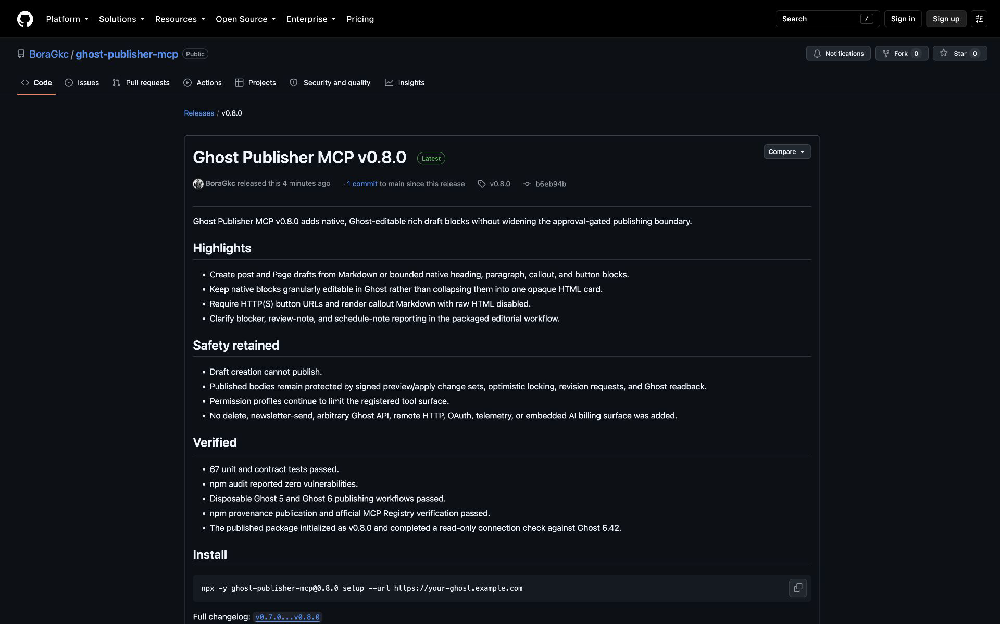
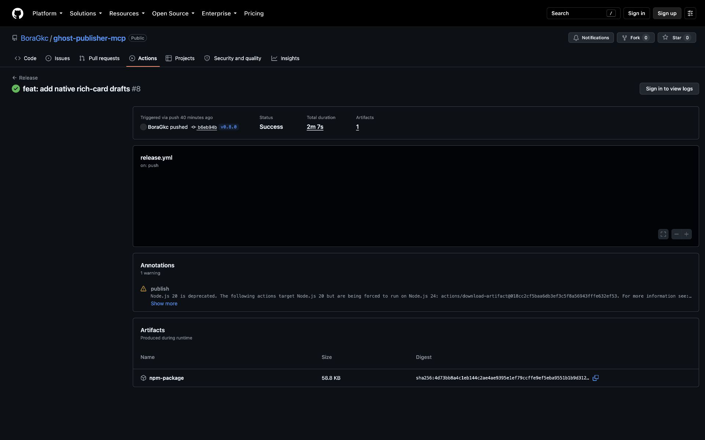

# Case study: running Ghost Publisher MCP at Ortak Alan

## Context

[Ortak Alan](https://ortakalan.io) is a live publication running Ghost `6.42`. The Ghost Publisher MCP maintainer uses the package in the publication's AI-assisted editorial workflow. This is a maintainer-operated case study, not an independent customer endorsement.

The workflow needed a local connection to Ghost with a deliberately narrow editing surface: inspect existing content, create drafts, preview exact changes, publish only after approval, trigger the configured static-site deployment once, and verify the rendered result.

## What was verified

On 2026-08-16 the active Codex configuration was upgraded from `ghost-publisher-mcp@0.4.1` to the exact `0.8.0` package through the setup command. The key stayed in the private user configuration and the captured plan was redacted.

The published npm package then initialized through the actual ChatGPT desktop `26.810.41047` runtime and its bundled Codex CLI `0.148.0-alpha.9`. A read-only `check_connection` call reached the configured Ortak Alan host and reported Ghost `6.42`. The release workflow separately passed the full integration suite against disposable Ghost 5 and Ghost 6 containers.

No live post, Page, image, schedule, deployment, or other production content was changed for this verification.

## Result

- The live operator configuration is pinned to `ghost-publisher-mcp@0.8.0`.
- The installed application runtime discovered the MCP server and completed a real read-only request to the production Ghost instance.
- The release is published on [npm](https://www.npmjs.com/package/ghost-publisher-mcp), the [official MCP Registry](https://registry.modelcontextprotocol.io/v0.1/servers/io.github.BoraGkc%2Fghost-publisher/versions/0.8.0), and [GitHub Releases](https://github.com/BoraGkc/ghost-publisher-mcp/releases/tag/v0.8.0).
- The package retains its permission profiles, revision checks, approval gates, and no-automatic-retry boundary.

## Evidence

The repository also includes a [60-second setup tour](https://github.com/BoraGkc/ghost-publisher-mcp/releases/download/v0.8.0/setup-demo-60s.mp4) and a reproducible [safe publishing demo](safe-publish-demo.md).

## Limitations

Cursor and Claude Desktop configuration generation is covered by automated tests, but neither application runtime was installed on the verification Mac. They remain runtime-unverified until the applications are available. This case study includes no external user study, usage telemetry, growth result, fabricated testimonial, or claim that the project is safer than every alternative.
